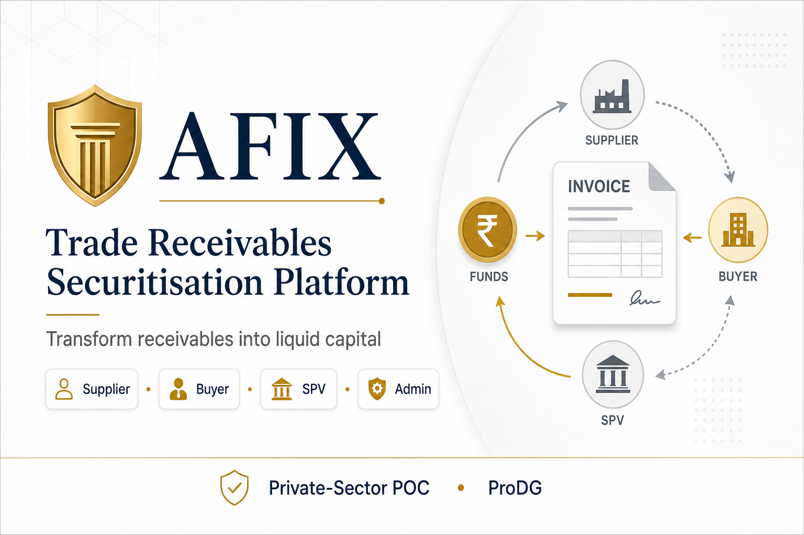

# AFIX — Trade Receivables Securitisation Platform

**Transform receivables into liquid capital.** AFIX is a private-sector trade receivables securitisation platform with role-based portals for **Suppliers**, **Buyers**, **SPV**, and **Admin** — covering listing, verification, offers, buyer consent, packaging, and settlement.



## Live demo

```bash
npm install
npm run dev
```

Open **http://localhost:5173**

## Demo accounts

Password for all: **`Afix2026!`**

| Role     | Email               |
|----------|---------------------|
| Supplier | supplier@afix.co.ke |
| Buyer    | buyer@afix.co.ke    |
| SPV      | spv@afix.co.ke      |
| Admin    | admin@afix.co.ke    |

## Features

- **Supplier** — list invoices, review offers, track lifecycle
- **Buyer** — verify register, sign assignment consent, payment schedule
- **SPV** — IOU registry, purchase offers, packaging & NSE USP, backend engine
- **Admin** — pipeline analytics, users, workflow monitor

## Stack

React 18 · TypeScript · Vite · Tailwind CSS · Recharts · mock-data only (no backend required)

## Scripts

| Command           | Description              |
|-------------------|--------------------------|
| `npm run dev`     | Development server       |
| `npm run build`   | Production build         |
| `npm run preview` | Preview production build |

---

© 2026 AFIX Capital · ProDG Engineering
